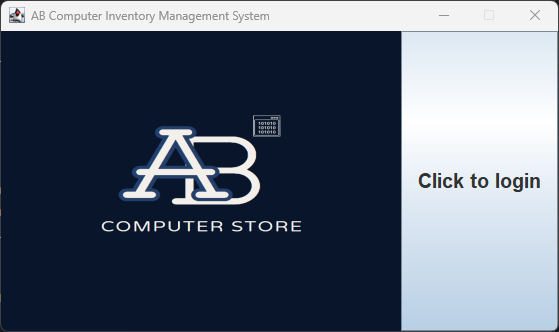
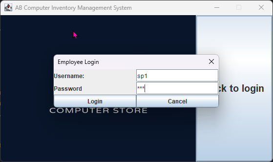
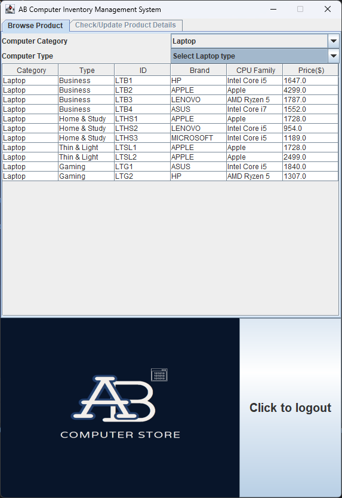
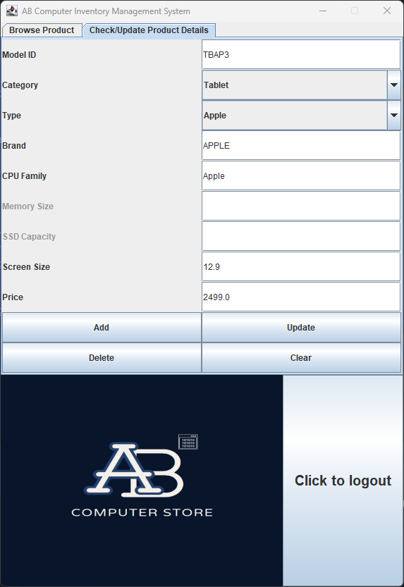

# AB Computer Inventory Management System

## Overview
- The AB Computer Inventory Management System is a Java-based application designed to manage a catalog of computer products.
It provides functionalities for browsing, searching, adding, updating, and deleting records of desktop PCs, laptops, and tablets.
The system includes user roles such as managers and salesperson, with role-based permission to access certain features.
---
## Features
- User Authentication: Login and logout functionality with role-based access control.
- Role-Based Permission: 
    - Managers can view and modify inventory.
    - Salesperson can only view inventory.
- Inventory Management:
    - Browser products by categories and types.
    - Add, update, or delete products records.
- Tabbed Interface: Seamless navigation between browsing and management functionalities.
- Data Persistence: Loads product data from a `computers.txt` file at startup.
- Dynamic Updates: UI updates dynamically based on action like search, selection, and role-based permission.
---
## Data File
- `computers.txt`: Contains sample product data with the following format:
```
Category,Type,ID,Brand,CPU Family,[Specific Attributes],Price
```
**Desktop PCs** has the following specific attributes: **Memory size** and **ssd capacity**.  
**Laptop** has the following specific attributes: **Memory size**, **ssd capacity**, and **screen size**.  
**Tablet** has the following specific attribute: **Screen size**.


## Technology Used
- **Programming Language**: Java
- **Libraries**:
  - javax.swing: For building the GUI (Graphical User Interface).
  - java.awt: For creating layout and UI components.
  - javax.imageio.ImageIO: For image handling.

## How to Run
1. Clone the Repository:
```
git clone <repository_url>
```
2. Prepare the Environment:
- Install Java Development Kit (JDK) on your machine (JDK 8 or higher).
- Use an IDE such as IntelliJ IDEA or Eclipse.
3. Run the Application:
- Compile and run the `ComputerStore` class to launch application.

## Usage
### Login
- Username: Use `sp1`, `sp2`, `sp3` for salesperson role.
- Password: Same as the username.
- Username: Use `m1` or `m2` for manager role.
- Password: Same as the username.

### Browsing Products
- Use the "Browse Product" tab to search and view products by category and type.

### Manage Products
- Use the "Check/Update Product Details" tab (available to managers only) to:
  - Add a new product.
  - Update an existing product.
  - Delete a product.

## Future Enhancements
- **Export to File**: Add functionality to save changes back to the `computers.txt` file.
- **Improved Search**: Implement advanced filters and sorting options.
- **Enhanced Security**: Encrypts password and implement secure authentication.

## Acknowledgements
Developed as part of learning project to practise Java Swing, file handling, and object-oriented programming concepts.

## Images and Screenshots
 Main Screen

 Login Screen

 Salesperson View

 Manager View